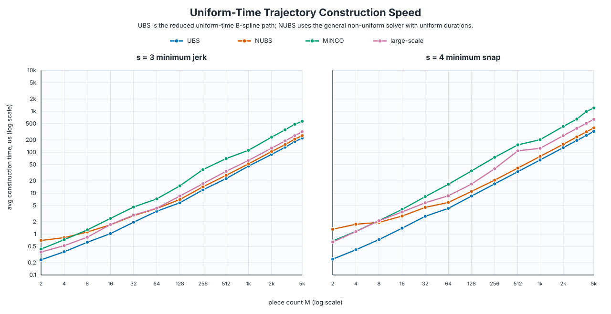

# NUBSTrajectory

A lightweight C++ header-only implementation of **non-uniform B-spline (NUBS) trajectories** for minimum-control-effort trajectory generation.

> **NUBS** means **Non-Uniform B-Spline**. It is not NURBS: no rational weights are used.

## Features

- Construct non-uniform B-spline trajectories from boundary states, intermediate waypoints, and segment durations.
- Support common minimum-control-effort system orders:
  - `s = 2`: minimum acceleration
  - `s = 3`: minimum jerk
  - `s = 4`: minimum snap
- Use degree:

$$
p = 2s - 1
$$

- Use control point count:

$$
N_c = M + 2s - 1
$$

where `M` is the number of trajectory segments.

- Evaluate position and derivatives.
- Compute minimum-control-effort energy:

$$
E = \int_0^T \|p^{(s)}(t)\|^2 dt
$$

- Propagate energy gradients to intermediate points and segment times.
- Propagate energy gradients to intermediate points and one fixed-ratio
  total-duration variable, avoiding per-segment time gradients in optimization
  loops that keep the time allocation ratios fixed.
- Provide both runtime-order and fixed-order APIs.
- Include focused tests against MINCO construction, energy, and gradient propagation.

## Basic Form

The trajectory is represented as

$$
p(t) = \sum_{i=0}^{N_c-1} N_{i,p}(t; u(T)) C_i,
$$

where $N_{i,p}$ is the B-spline basis function, $u(T)$ is the open-clamped non-uniform knot vector generated from segment durations, and $C_i$ are control points.

The control points are recovered from a structured linear system:

$$
A(T) C = b(P).
$$

Here `A(T)` is assembled from the boundary and waypoint constraints, while `b(P)` contains the prescribed boundary states and intermediate waypoints. Since the B-spline basis has local support, this system is banded.

## Smaller Forward Construction System

For a trajectory with `M` segments and system order `s`, NUBSTrajectory solves for

$$
N_c = M + 2s - 1
$$

B-spline control points per dimension.

In a MINCO-style piecewise polynomial construction, each segment has `2s` polynomial coefficients per dimension, so the forward linear system size is

$$
2Ms.
$$

Therefore, for the same `M` and `s`, the NUBS forward construction system is smaller:

$$
M + 2s - 1 \quad \text{vs.} \quad 2Ms.
$$

This is one practical reason to use the B-spline representation: the external trajectory still satisfies the same boundary and waypoint constraints, while the forward construction solves a lower-dimensional banded system.

## Why It Is Equivalent to MINCO

MINCO usually represents the trajectory with piecewise polynomial coefficients. This project represents the same minimum-control-effort trajectory with a non-uniform B-spline basis.

For the same system order `s`, segment times, boundary states, and intermediate waypoint constraints, both formulations solve the same constrained minimum-control-effort problem. The difference is the internal basis:

- MINCO uses piecewise polynomial coefficients.
- NUBSTrajectory uses non-uniform B-spline control points.

Because both bases span the same polynomial trajectory space under the same constraints, the resulting trajectory, energy, and propagated gradients are numerically equivalent. The tests compare NUBS against MINCO for construction, energy, coefficient-space energy gradients, waypoint gradients, and time gradients.

## API

Include:

```cpp
#include "NUBSTrajectory.hpp"
```

Runtime-order API:

```cpp
nubs::NUBSTrajectory<3> traj(3); // Dim = 3, s = 3
```

Fixed-order API:

```cpp
nubs::CubicNUBS<3> cubic;     // NUBSTrajectoryT<3, 2>
nubs::QuinticNUBS<3> quintic; // NUBSTrajectoryT<3, 3>
nubs::SepticNUBS<3> septic;   // NUBSTrajectoryT<3, 4>
```

Uniform-time aliases:

```cpp
nubs::UniformCubicNUBS<3> uniform_cubic;
nubs::UniformQuinticNUBS<3> uniform_quintic;
nubs::UniformSepticNUBS<3> uniform_septic;

// Short aliases for the dedicated uniform B-spline construction path.
nubs::CubicUBS<3> cubic_ubs;
nubs::QuinticUBS<3> quintic_ubs;
nubs::SepticUBS<3> septic_ubs;
```

The fixed-order implementation uses compile-time Gauss rules, fixed-degree basis kernels, and fixed-degree matrix assembly for construction and gradient propagation. The default optimization path uses centered finite-difference time gradients with local affected-span and affected-row reduction. The analytic time-gradient path is kept mainly for validation.

For a smaller timing decision space, use the fixed-ratio total-duration path:

```cpp
Eigen::VectorXd ratios(3);
ratios << 1.0, 1.2, 1.0; // ratios do not need to sum to one

const double total_duration = 3.2;
traj.generateWithTotalDuration(P_inner, headState, tailState,
                               ratios, total_duration, control_points);

double cost = 0.0;
Eigen::MatrixXd grad_points;
double grad_total_duration = 0.0;
traj.getEnergyAndFixedRatioGrad(cost, grad_points, grad_total_duration);
```

This treats `T_i = total_duration * ratios_i / sum(ratios)` and returns a
single scalar time gradient. Internally the gradient path perturbs only the
total duration while preserving ratios, so it does not run the per-segment
time-gradient loop.

For uniform segment times, use the semantic alias and helper:

```cpp
nubs::UniformQuinticNUBS<3> uniform_traj;
uniform_traj.generateUniform(P_inner, headState, tailState,
                             total_duration, control_points);

double uniform_cost = 0.0;
Eigen::MatrixXd uniform_grad_points;
double uniform_grad_total_duration = 0.0;
uniform_traj.getEnergyAndUniformTimeGrad(uniform_cost,
                                         uniform_grad_points,
                                         uniform_grad_total_duration);
```

`UniformNUBSTrajectoryT` uses a reduced uniform-time construction path. The
first and last `S` control points are recovered directly from boundary states,
and only the `M - 1` interior control points are solved from a constant
factorized banded matrix cached by piece count.

## Usage Example

```cpp
#include "NUBSTrajectory.hpp"

#include <Eigen/Dense>

int main()
{
    constexpr int Dim = 3;
    constexpr int S = 3; // minimum jerk, degree p = 5

    nubs::NUBSTrajectoryT<Dim, S> traj;

    Eigen::MatrixXd headState(Dim, S);
    Eigen::MatrixXd tailState(Dim, S);

    // columns: position, velocity, acceleration
    headState.col(0) = Eigen::Vector3d(0.0, 0.0, 0.0);
    headState.col(1) = Eigen::Vector3d(0.0, 0.0, 0.0);
    headState.col(2) = Eigen::Vector3d(0.0, 0.0, 0.0);

    tailState.col(0) = Eigen::Vector3d(5.0, 3.0, 1.0);
    tailState.col(1) = Eigen::Vector3d(0.0, 0.0, 0.0);
    tailState.col(2) = Eigen::Vector3d(0.0, 0.0, 0.0);

    Eigen::MatrixXd P_inner(2, Dim);
    P_inner.row(0) = Eigen::RowVector3d(1.5, 1.0, 0.5);
    P_inner.row(1) = Eigen::RowVector3d(3.5, 2.5, 0.8);

    Eigen::VectorXd T(3);
    T << 1.0, 1.2, 1.0;

    Eigen::MatrixXd control_points;
    traj.generate(P_inner, headState, tailState, T, control_points);

    const double t = 1.5;
    Eigen::Vector3d pos = traj.evaluate(t, 0);
    Eigen::Vector3d vel = traj.evaluate(t, 1);
    Eigen::Vector3d acc = traj.evaluate(t, 2);
    Eigen::Vector3d jerk = traj.evaluate(t, 3);
    double energy = traj.getEnergy();

    return 0;
}
```

## Tests

Tests are split into separate executables under `src/`.

Main groups:

- Basic construction checks for `s = 2, 3, 4`
- Minimal API usage smoke test
- MINCO trajectory and energy comparisons
- Uniform-time comparisons against the vendored
  `include/large_scale_traj_opt/` implementation for minimum jerk and snap
- MINCO energy-gradient propagation comparisons
- Centered finite-difference gradient checks
- Generic vs fixed-order equivalence checks
- Local finite-difference vs full finite-difference checks
- Small-duration robustness checks
- A small benchmark for `Dim = 3`, `s = 3`

Build and run:

```bash
cmake -S . -B build
cmake --build build
ctest --test-dir build --output-on-failure
```

The large-scale optimizer comparison can also be run directly:

```bash
./bin/test_large_scale_uniform_compare
```

It checks uniform NUBS against `JerkOpt` and `SnapOpt` for objective and
sampled position/velocity/acceleration consistency, then prints construction
and evaluation timings.

Construction-speed benchmark and plot:

```bash
./bin/bench_large_scale_construction 1000 build/uniform_construction_speed.csv
python3 scripts/plot_uniform_construction_speed.py \
    build/uniform_construction_speed.csv \
    docs/images/uniform_construction_speed.svg
```

The plot compares uniform-time `NUBS` (the general non-uniform solver given
uniform durations), `UBS` (the dedicated reduced uniform-time B-spline path),
original `MINCO`, and the vendored `large_scale_traj_opt` implementation. The
two centered panels show `s = 3` and `s = 4` separately.



## Repository Layout

- `include/NUBSTrajectory.hpp`: main implementation
- `include/gcopter/`: vendored MINCO-related headers used for comparison tests
- `include/large_scale_traj_opt/`: vendored headers from
  `ZJU-FAST-Lab/large_scale_traj_optimizer` used for uniform-time comparison
- `include/tools/`: test helpers and MINCO adapter
- `src/`: test and benchmark entry points

## Acknowledgments

- B-spline theory provides the basis representation, derivative evaluation, and local support properties used by this implementation.
- MINCO is used as an important reference for construction and gradient propagation. See [Geometrically Constrained Trajectory Optimization for Multicopters](https://ieeexplore.ieee.org/document/9765821).
- This project was inspired by the minimum-control-effort / minimum-norm trajectory solving idea in [Bziyue/SplineTrajectory](https://github.com/Bziyue/SplineTrajectory).
